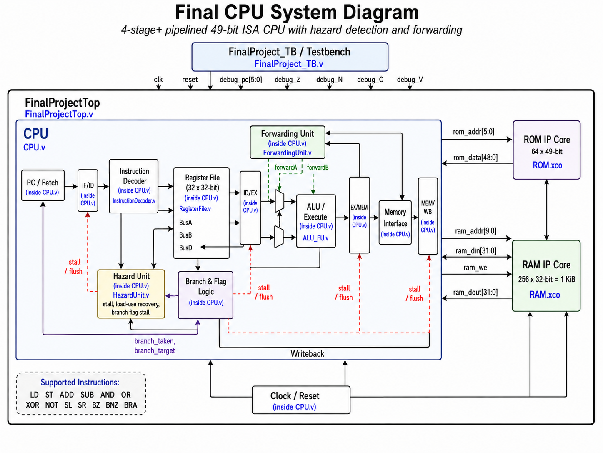

# Custom Pipelined RISC CPU in Verilog



This project is a custom pipelined RISC-style CPU written in Verilog and originally developed in Xilinx ISE. The processor uses a 49-bit instruction format, a register file, ALU, ROM instruction memory, RAM data memory, hazard detection, forwarding, branch handling, and memory control signals.

The design was created as a final microprocessor architecture project and demonstrates how a complete CPU datapath can be built from individual hardware modules.

## Project Overview

The CPU supports:

- Load and store instructions
- Arithmetic operations
- Logical operations
- Shift operations
- Conditional branches
- Unconditional branches
- Pipeline hazard detection
- Data forwarding
- Load-use stall recovery
- Branch flushing

The processor fetches instructions from ROM, decodes them, reads operands from the register file, executes operations through the ALU, accesses RAM when needed, and writes results back to the register file.

## Instruction Format

Each instruction is 49 bits wide:

```text
[48:44] opcode
[43:42] mode
[41:37] source register
[36:32] destination register
[31:0]  literal / address / register field
```

## Supported Instructions

| Opcode | Instruction | Description |
|---|---|---|
| 0x01 | LD  | Load immediate or memory value into register |
| 0x02 | ST  | Store register value into RAM |
| 0x03 | ADD | Addition |
| 0x04 | SUB | Subtraction |
| 0x05 | AND | Bitwise AND |
| 0x06 | OR  | Bitwise OR |
| 0x07 | XOR | Bitwise XOR |
| 0x08 | NOT | Bitwise NOT |
| 0x09 | SL  | Shift left |
| 0x0A | SR  | Shift right |
| 0x10 | BZ  | Branch if zero flag is set |
| 0x11 | BNZ | Branch if zero flag is not set |
| 0x12 | BRA | Unconditional branch |

## Memory Configuration

### ROM

```text
Depth: 64 locations
Width: 49 bits
Address bus: 6 bits
Data bus: 49 bits
File: ROM.xco
```

### RAM

```text
Depth: 256 words
Width: 32 bits
Total size: 1 KiB
Address bus: 8-bit word address
CPU address bus: 10-bit byte address
File: RAM.xco
```

The CPU uses byte-style addresses, while the RAM IP uses word addressing. In the top-level module, the RAM address is connected as:

```verilog
.addra(ram_addr[9:2])
```

## Main Modules

| File | Purpose |
|---|---|
| FinalProjectTop.v | Top-level module connecting the CPU, ROM, and RAM |
| CPU.v | Main pipelined CPU datapath and control logic |
| InstructionDecoder.v | Decodes the 49-bit instruction fields and generates control signals |
| RegisterFile.v | 32-register file used by the CPU |
| ALU_FU.v | Arithmetic and logic execution unit |
| HazardUnit.v | Detects load-use hazards, branch flag hazards, and pipeline stalls |
| ForwardingUnit.v | Resolves data hazards through forwarding |
| FinalProject_TB.v | Testbench used for simulation |
| ROM.xco | Xilinx ROM IP core |
| RAM.xco | Xilinx RAM IP core |

## Pipeline and Hazard Handling

The CPU uses pipeline registers between stages:

- IF/ID
- ID/EX
- EX/MEM
- MEM/WB

The forwarding unit forwards results from later pipeline stages back into the ALU input path. This avoids unnecessary stalls for many ALU-to-ALU dependencies.

The hazard unit detects situations where forwarding is not enough, such as load-use hazards. Since the memory IP cores are synchronous, the CPU also includes recovery logic to prevent the instruction stream from skipping instructions after a stall.

Branches are handled using ALU flags and pipeline flushing. When a branch is taken, younger pipeline instructions are cleared and the program counter is redirected to the branch target.

## Flags

```text
Z = Zero flag
N = Negative flag
C = Carry flag
V = Overflow flag
```

These flags are used by branch instructions such as BZ and BNZ.

## Simulation

The project was tested using ISim behavioral simulation. The testbench verifies arithmetic, logic, memory access, forwarding, stalls, and branching behavior.

A successful full test keeps the error register clear:

```text
regfile[30] = 00000000
```

The test program verifies:

- Register-to-register operations
- Immediate operations
- Store and load through RAM
- Load-use stall recovery
- Branch taken and branch not taken behavior
- Forwarding from pipeline stages
- ALU flag behavior

## Useful Waveform Signals

```text
pc
rom_addr
rom_data
if_id_instr
id_ex_opcode
alu_result
flag_Z
branch_taken
branch_target
load_use_stall
load_recover_count
forwardA
forwardB
ram_addr
ram_din
ram_dout
ram_we
mem_wb_result
regfile[30]
```

## Development Notes

This project was originally developed in Xilinx ISE using .xco memory IP cores. If the design is moved to Vivado, the ROM and RAM IP cores may need to be recreated using Vivado Block Memory Generator IP.

The CPU was designed mainly for simulation and architecture demonstration, but the design could be expanded for FPGA hardware use by adding memory-mapped I/O, buttons, display output, or hardware accelerators.

## Future Improvements

- Vivado migration
- Memory-mapped I/O
- UART output
- VGA or HDMI display support
- Hardware game or graphics accelerator
- Larger instruction ROM
- Larger data RAM
- Assembler support for the custom ISA
- FPGA implementation with real input/output peripherals

## Author

Jonah Jordan
